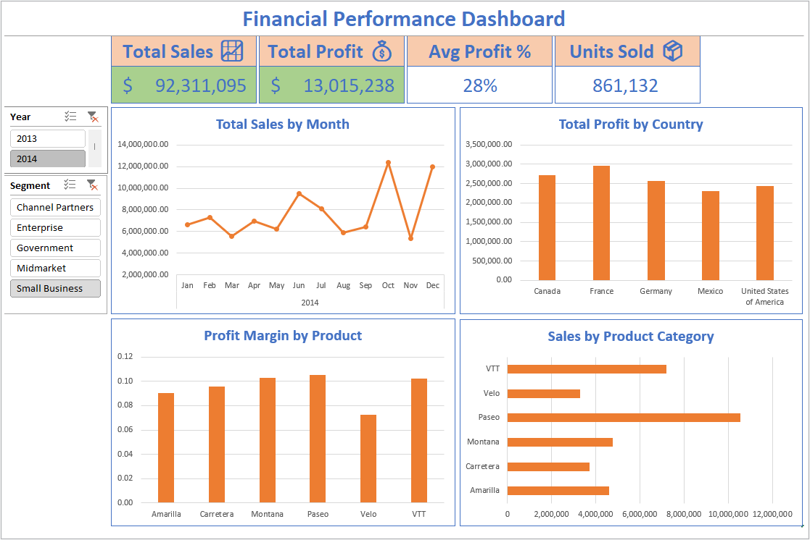
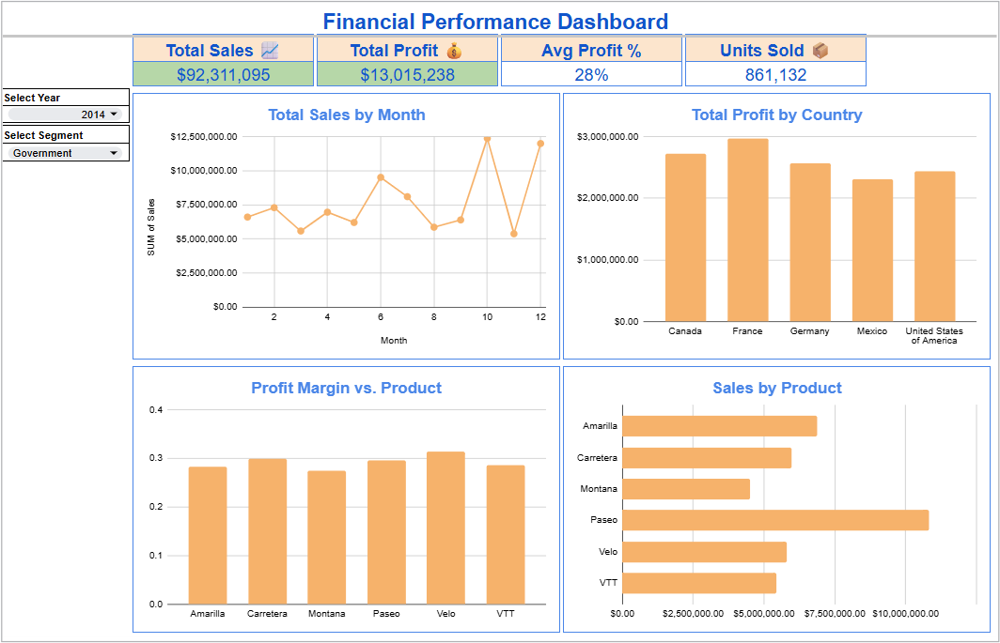
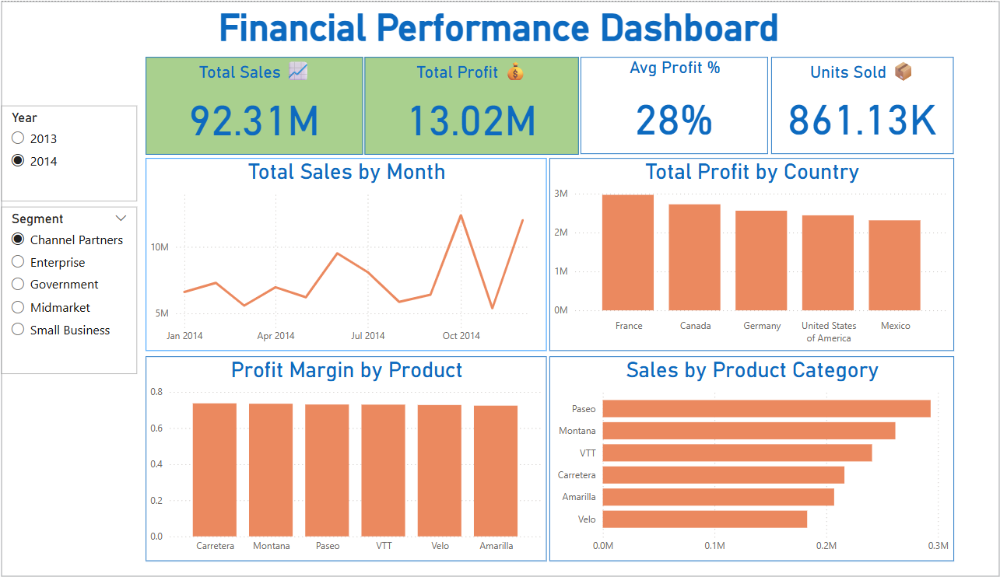

# Financial Performance Dashboard – Excel, Google Sheets & Power BI

## Table of Contents
  - [Objective](#objective)
  - [Dataset](#dataset)
  - [Tools](#tools)
  - [Methodology](#methodology)

### Objective

This project showcases a financial analysis dashboard built using Excel, Google Sheets, and Power BI. The dashboard supports decision-making by visualizing key financial metrics like sales, profit, and profit margin, using three widely used platforms to demonstrate tool versatility.

### Dataset

The dataset from Kaggle (https://www.kaggle.com/datasets/buny12345/financial-sample-power-bi-dashboard) contains the following key features:

- Date-based sales transactions spanning multiple months
- Geographical data: Country and Segment
- Product-level breakdowns: Product name, units sold, sale price, discount bands
- Financial metrics: Gross Sales, Discounts, Net Sales, Cost of Goods Sold (COGS), and Profit
- A calculated Profit Margin column was created for additional analysis

## Tools

- Excel: Used for pivot tables, slicers, KPI cards, conditional formatting, and overall dashboard layout
- Google Sheets: Recreated the Excel dashboard with dropdown filters and dynamic formulas (e.g., FILTER, SUMIF)
- Power BI: Built an interactive BI version using DAX for KPI logic, slicers for user-driven filtering, and conditional formatting for data highlights

## Methodology
### 1. Data Cleaning and Preparation

- Checked date and numeric fields
- Added derived columns like Profit Margin and Month-Year

### 2. KPI Creation

- Total Sales, Total Profit, Units Sold, Average Profit Margin

### 3. Dashboard Development

- Excel: Created slicer-driven pivot visuals and KPI cards with conditional formatting
- Google Sheets: Used dropdown filters + dynamic formulas to replicate slicer behavior
- Power BI: Created dynamic visuals using DAX, and configured slicer-to-visual interactions

[Google Sheets Dashboard](https://docs.google.com/spreadsheets/d/1jRZ4mYS42yR1UPARqchxGpmeELmqhREugNSkoPzuViw/edit?usp=drive_link)

[Power BI Dashboard](https://github.com/galaes/Financial-dashboard/blob/4af67fe00576437ca64eee50994798329eff5974/Financial%20Performance%20Dashboard.pbix)

## Insights and Findings

- Seasonal trends: Sales and profits showed strong performance in specific months
- Country-level analysis: Some countries consistently outperformed others in both revenue and margin
- Product profitability: Certain products had high sales volume but low profit margin, indicating cost inefficiencies
- Segment behavior: Differences between Government and Midmarket segments highlighted distinct purchasing patterns
